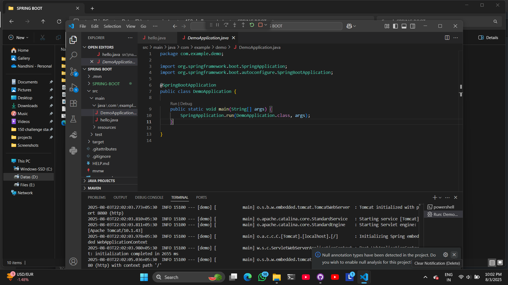
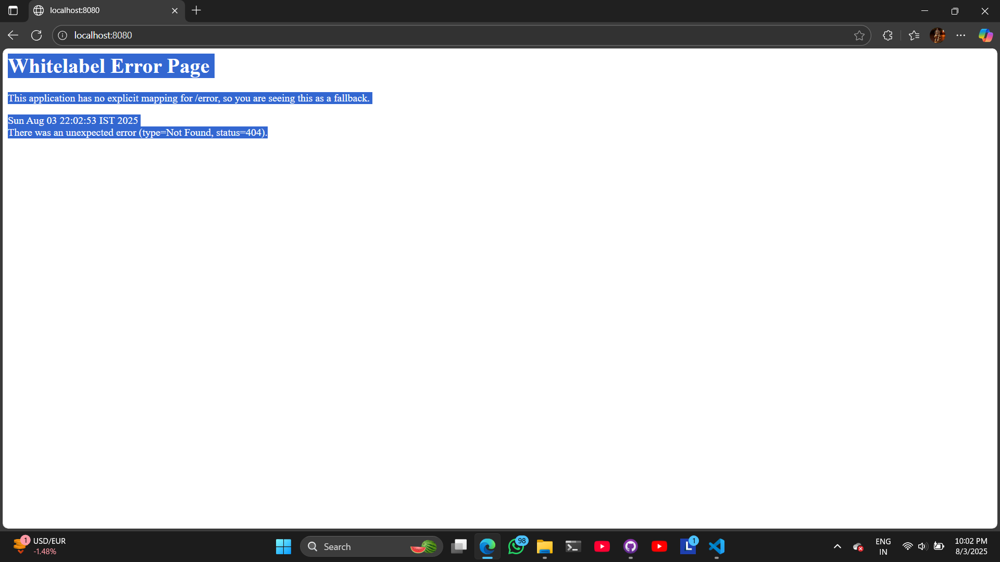
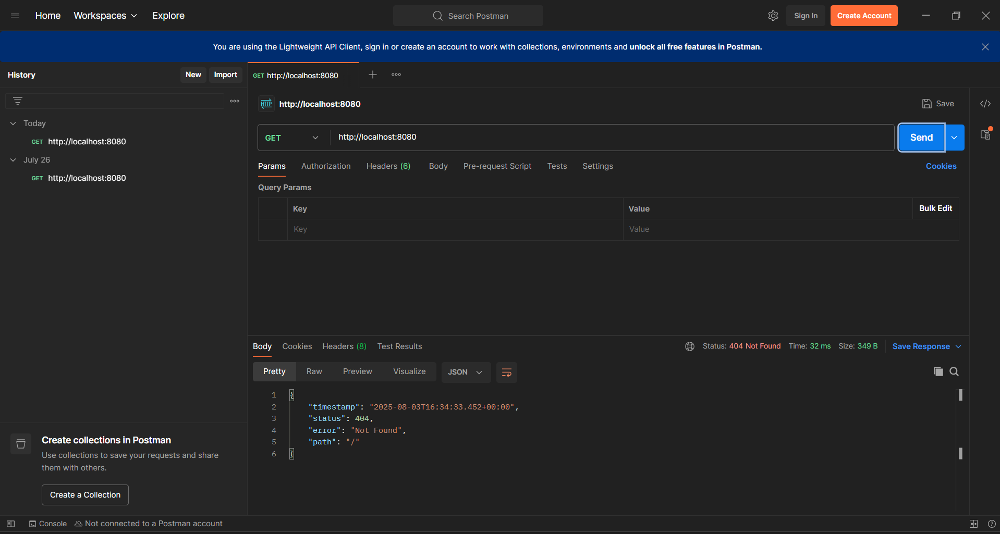
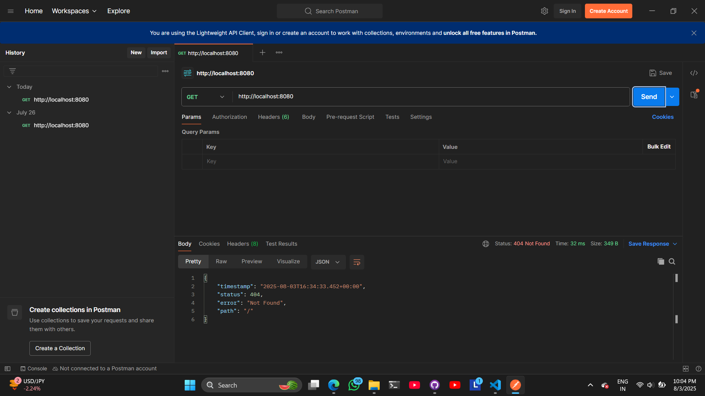
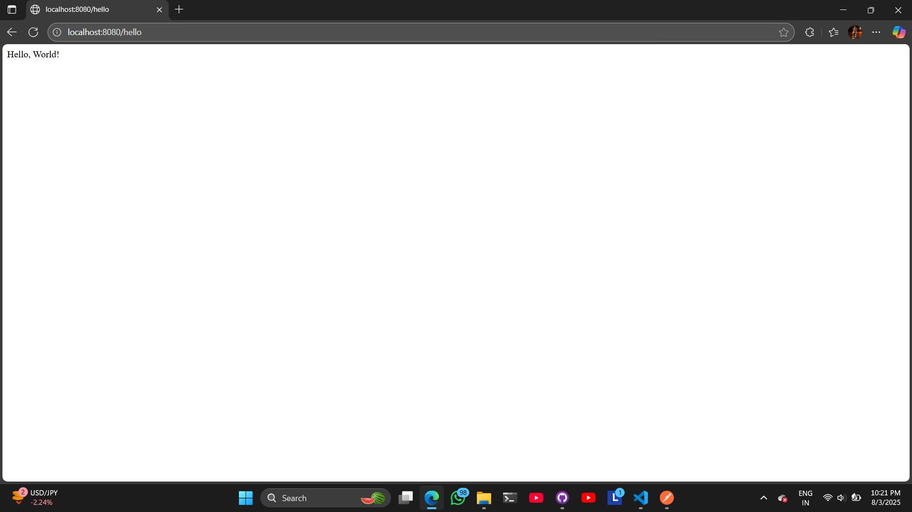

# spring booting
* to build api
  
# need for spring
* java
* ide-also vsc
* sprign intialize to config th e spring
* maven-build tols

# create a config on spring initializer

* in the dependies ti click spring web
* click generate
* or download

it need need to com eot the will run correctly

# helo word inapi
* all  anitation in sprinf]g---@s start ith 
* tio write api in class to create a anitation called restcontroller
* when enter the dependies will importing in vsc
* ading in depemdicy in spring initializer hwich inporting he dependies

# printing a gello world
--to get the message in bro

localhost;:8080/filename(hello)

# wors in api
request,response---is callwd cliwnt servr architeture
* server-user
* end point--->/file,/tag inthat url kula iruka place tha iruka file the end point
* \\-it will take the api call the particular antha intha kuduku ena pananu---
* ex:/hello na antha page ku pogum-**/hello**-tha end point
* in get mapping puting the /hello 0--code la intha function run panunum
* api in ovunum ena pananum atha solrathu
* api-->give the daa to acces 
* user got to home page click panum podhu api call-server call-user clik what to do to api thevayana details ned show in api all in database anga irundu kuduka
* user cant acces teh databse so only use teh api
* only authorise teh database
* we use teh api funtion that will call
* authorise to security
* to use teh api in communication medium
# api is in the communication between the api and database

# get mapping
### http request types
* get    -TO CREATEA NEW  TO POST REQUEST TO ---           DEFIN---TO RETRIVE THE ACOUND DETAIL
* putn     -------------------------------------           DEFIN---TO UPDATION
* PUT IS UPDATE ALL IN DATA
* patch    -TO CREATEA NEW ---------------------           DEFIN---IN PATCH PUT IN UPDAE ALL ,IT WILL SPECIFIC UPDATE
* post       -TO CREATEA NEW -------------------           DEFIN----ACCOUNT CREATE 
* delete     -TO CREATEA NEW -------------------           DEFIN-----DELETE
^           DEFIN---
|^

# http:to share info in interrnet in httpn
